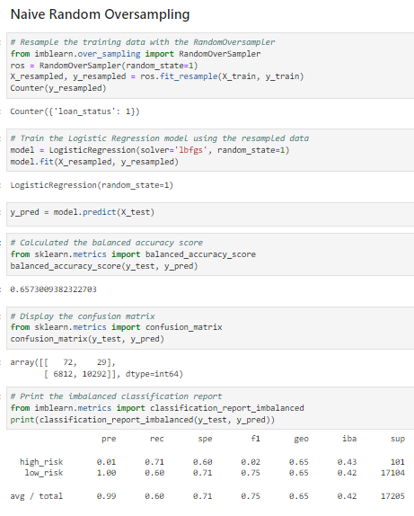
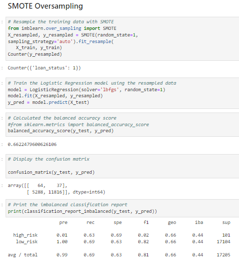
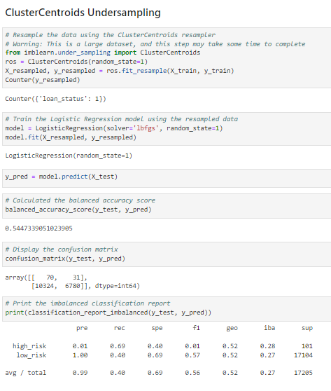
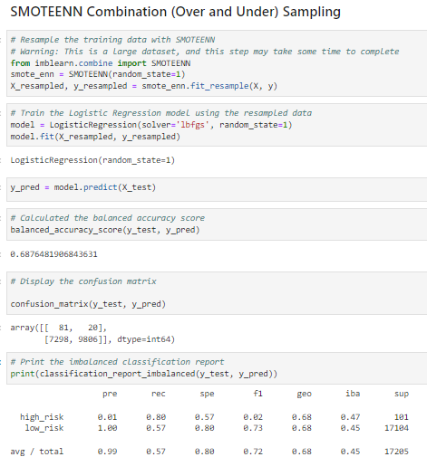
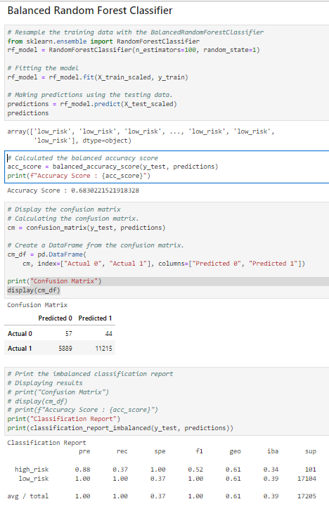
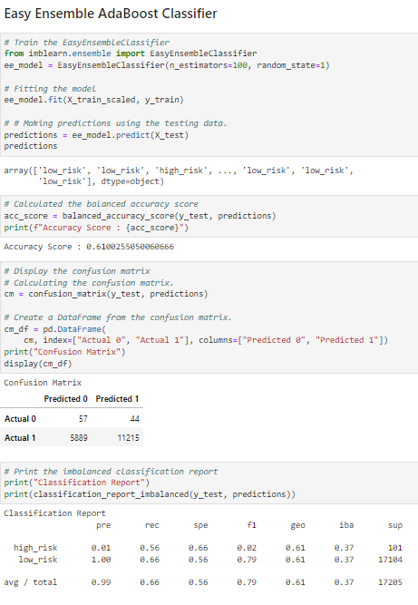

# Credit_Risk_Analysis
Module 17

## Overview
Credit risk is an inherently unbalanced classification problem, as good loans easily outnumber risky loans. Therefore, we need to employ different techniques to train and evaluate models with unbalanced classes. Jill asks you to use imbalanced-learn and scikit-learn libraries to build and evaluate models using resampling.

Using the credit card credit dataset from LendingClub, a peer-to-peer lending services company, used techniques to oversample the data using the RandomOverSampler and SMOTE algorithms, and undersample the data using the ClusterCentroids algorithm. Then, used combinatorial approach of over- and undersampling using the SMOTEENN algorithm. Next, comparee two new machine learning models that reduce bias, BalancedRandomForestClassifier and EasyEnsembleClassifier, to predict credit risk. Once completed, evaluated the performance of these models and made a written recommendation on whether they should be used to predict credit risk.

## Results

Following imbalanced machine learning models were developed and their performance metrics as shown below: 

1. **Naive Random Oversampling**
    * The balanced accuracy score is 0.6573009382322703
    * The overall precision is 0.99. The precision for high risk is 0.01
    * The overall recall score is 0.60. The recall score  for high risk is 0.71 

2. **SMOTE Oversampling**
    * The balanced accuracy score is 0.6622479600626106
    * The overall precision is 0.99. The precision for high risk is 0.01
    * The overall recall score is 0.69. The recall score  for high risk is 0.63 

3. **ClusterCentroids Undersampling**
    * The balanced accuracy score is 0.5447339051023905
    * The overall precision is 0.99. The precision for high risk is 0.01
    * The overall recall score is 0.40. The recall score  for high risk is 0.69

4. **SMOTEENN Combination (Over and Under) Sampling**
    * The balanced accuracy score is 0.6876481906843631
    * The overall precision is 0.99. The precision for high risk is 0.01      
    * The overall recall score is 0.57. The recall score  for high risk is 0.80 

5. **Balanced Random Forest Classifier**
    * The balanced accuracy score is 0.6830221521918328
    * The overall precision is 1.00. The precision for high risk is 0.88            
    * The overall recall score is 1.00. The recall score  for high risk is 0.37       

 
6. **EasyEnsembleClassifier**
    * The balanced accuracy score is 0.6100255050060666
    * The overall precision is 0.99. The precision for high risk is 0.01                  
    * The overall recall score is 0.66. The recall score  for high risk is 0.56            

## Summary

Below is the high level summary result of all machine learning models. 

| Model      |  Accuracy score |  Precision   | Recall| F1  | High Risk precision| High Risk Recall| High Risk F1|
| ----------- | ----------- | ----------- | ----------- | ----------- | ----------- |----------- |----------- |
|**Naive Random Oversampling** | 0.6573       |0.99 |0.60| 0.75      |0.01|0.71 |0.02      |
|**SMOTE Oversampling** |  0.6622       |0.99 |0.69| 0.81       |0.01|0.63  |0.02         |
|**ClusterCentroids Undersampling** | 0.5447     |0.99 |0.40| 0.56            |0.01|0.69 |0.01              |
|**SMOTEENN Combination (Over and Under) Sampling** |   0.6876       |0.99 |0.57| 0.72           |0.01|0.80   |0.02         |
|**Balanced Random Forest Classifier** |   0.6830      | 1.00 |0.37| 1.00       |0.88 |0.37  |0.52           |
|**EasyEnsembleClassifier** |  0.6100     | 0.99 |0.56 | 0.79       |0.01 | 0.56   |0.02               |

While determining credit risk, it is important to detect high risk customers better, hence sensitivity (recall) is more important than the precision. Of all 6 algorithms, SMOTEENN combinatoral algorithm have the best accuracy score and best recall for High Risk group. 

It is recommended not to use any of the models because none of the models resulted high recall score to be able to confidently predict high risk group. 